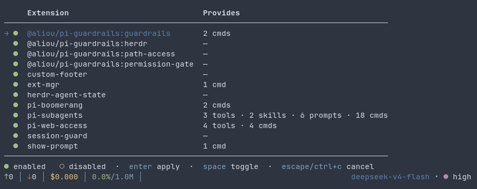

# pi-extension-mgr

Enable and disable pi extensions from the `/ext-mgr` command or the
`--ignore-extension` CLI flag.

> **Scope.** This extension only **enables and disables** extensions at runtime
> and through the CLI option. It does **not** install or remove extensions —
> use `pi install` / `pi remove` for that. A disabled extension acts like it is
> not loaded (its tools, skills, prompt templates, and slash commands are cut
> out); event-only hooks cannot be removed at runtime and are simply hidden.



## Install

```bash
pi install git:github.com/frasdl/pi-extension-mgr
```

> Once the package is published to npm, install it with
> `pi install npm:pi-extension-mgr` instead (publication is deferred).

## CLI flag

Disable extensions (their tools, skills, and prompts) at startup:

```bash
pi --ignore-extension "subagents,web-access"
pi --ignore-extension subagents --ignore-extension web-access
```

The flag is re-applied on every start, so the disables persist across sessions.

## Slash command

```bash
/ext-mgr             # interactive enable/disable menu (TUI)
/ext-mgr <pat>       # ignore extensions matching <pat>
/ext-mgr reset       # restore everything
```

Runtime changes are persisted as a session entry and restored on every session
start (`/reload`, `/resume`, `/fork`), just like the CLI flag.

## Cache safety

Disabling extensions is designed to keep the context/prefix cache intact:

- **No prompt modification when nothing is disabled** — with no extension
  ignored, the extension returns before ever touching the system prompt.
- **Deterministic and idempotent** — for unchanged state the effective system
  prompt is byte-identical on every turn, so the context/prefix cache stays
  intact.
- **Tools re-set on change only** — tools are re-applied only when the active
  count changes, not on every turn.
- **Single stable settle** — enabling/disabling settles the prompt to one
  stable form; there is no cumulative or repeated rewriting.
- **One caveat** — the skills block is re-derived at prompt-build time each
  turn (pi regenerates the full skill list), but deterministically, so the
  output bytes remain stable.

## How patterns match

Patterns are comma-separated substrings, matched case-insensitively against the
extension label, package name, source, file path, tool names, skill names, and
prompt-template names.

## How it works

- **tools** — `setActiveTools()`
- **skills** — rebuilds the `<available_skills>` block before each prompt
- **prompts / skills / extension commands** whose owning extension is ignored —
  intercepted via the `input` event and reported as disabled
- **event hooks** — not removable at runtime (limitation)

## License

MIT
